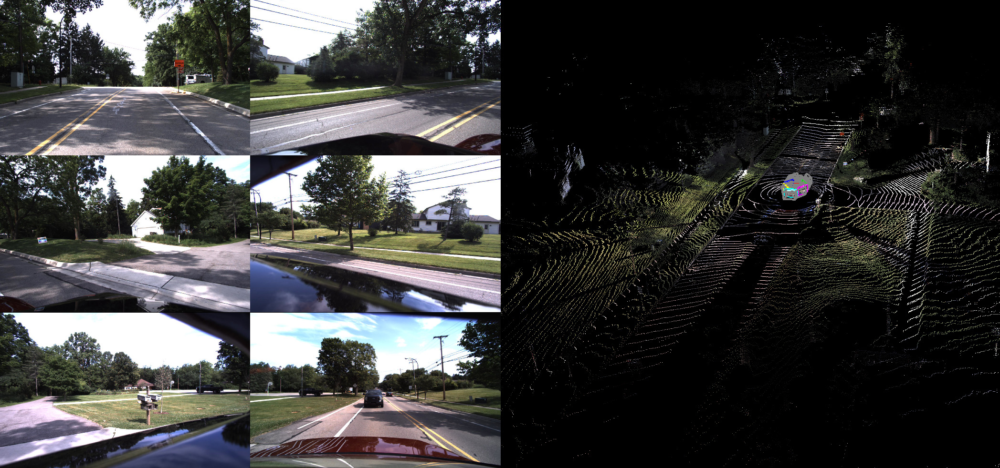

# Datasets for Embodied Foundation Models (EFM-Datasets)

<a href="https://www.tri.global/" target="_blank">
 
</a>

EFM-Datasets is a repository containing various open-source datasets used by the TRI-ML research group. It provides a simple and clean interface that maps all supported datasets onto the same batch structure convention. This enables the seamless combination of datasets for applications such as [sim-to-real](https://arxiv.org/abs/2103.16694), [self-supervised learning](https://arxiv.org/abs/1905.02693), [multi-view geometry](https://arxiv.org/abs/2207.14287), [volumetric rendering](https://arxiv.org/abs/2304.02797), [zero-shot scale-aware depth estimation](), [domain adaptation](), and many more. 

Although **EFM-Datasets** works as a standalone library, it was designed specifically to be used in conjunction with other TRI-ML's repositories, in particular [vidar](https://github.com/tri-ml/vidar), that uses it as a submodule; and [camviz](https://github.com/tri-ml/camviz), that is one of its submodules.

# Installation

```
git clone --recurse-submodules git@github.com:TRI-ML/efm_datasets.git
cd efm_datasets
xhost +local:
git submodule update --remote
make docker-interactive
```

# Configuration file

A list of configuration files for each dataset is provided in `scripts/config.yaml`.  Each dataset has its own set of fields, depending on specific options that can be made when instantiating the dataset, however a few of them are shared across all of them:

* **name**: *String*
  * Dataset name (which dataloader to use)
* **path**: *String* 
  * Dataset folder (where the dataset is stored)
* **split**: *String* (default="")
  * Which dataset split should be used (details are specific for each dataset).
* **context**: *List of Int* (default=[])
  * Temporal context for each camera (will return intermediary values as well)
* **cameras**: *List of Int* (default=[])
  * Spatial context (which cameras will be returned in the same batch)
* **labels**: *List of String* [*intrinsics*,*depth*,*pose*] (default=[])
  * Which labels will be returned with the batch (from the target frame) 
* **labels_context**: *List of String* [*intrinsics*,*depth*,*pose*] (default=[])
  * Which labels will be returned from the batch (from the context frames) 
* **depth_type**: *String*
  * Which depth type will be used when loading depth maps
* **repeat**: *Int*
  * How many times the dataset will be repeated to increase epoch length

**Loading single datasets:** An example of how to load the KITTI and DDAD datasets:

```
KITTI:
    name: [KITTI]
    path: [/data/datasets/tiny/KITTI_tiny]
    split: [kitti_tiny.txt]
    context: [-2,2]
    cameras: [[0,1]]
    labels: [intrinsics,depth,pose]
    labels_context: [intrinsics,depth,pose]
    depth_type: [velodyne]

DDAD:
    name: [Ourawboros]
    path: [/data/datasets/tiny/DDAD_tiny/ddad_tiny.json]
    split: [train]
    resolution: [[384,640]]
    context: [-2,2]
    cameras: [[1,5,6,7,8,9]]
    labels: [intrinsics,depth,pose]
    labels_context: [intrinsics,depth,pose]
    depth_type: [lidar]
    prefix: [CAMERA]
```

Given a configuration file (.yaml) stored somewhere, a dataset can be instantiated using:

```
from efm_datasets.utils.config import read_config
from efm_datasets.utils.setup import setup_dataset

cfg = read_config(<path_to_configuration_file>)
dataset = setup_dataset(cfg, verbose=True) # If verbose=True, print out some information about the dataset
```

# Output format

The output of `__getitem__(self, idx)` of a dataset is a batch dictionary, containing a key for each of its labels (more details below).  Each key contains a dictionary that is indexed by a combination between:

  * **context**: the timestep of that label, which **0** indicating the current timestep, **-X** indicating X timesteps in the past, and **+X** indicating X timesteps in the future.
  * **camera**: the camera from which that label was obtained. These are numbered from **0** to **N** according to the `cameras` field in the configuration file.  

Additionally, labels are defined as *per-sensor* or *per-sample*:

  * **Per-sensor** data is stored as a dictionary, with keys defined as tuples (*context*, *camera*)
  * **Per-sample** data is stored as a dictionary, with keys defined as a scalar *context*
    
The current supported labels are:

* **rgb**: *Dictionary*
  * (context, camera): 3xHxW tensor normalized between [0,1]
* **intrinsics**: *Dictionary*
  * (context, camera): 3x3 tensor with pinhole camera parameters [[fx, 0, cx];[0, fy, cy];[0, 0, 1]]
* **pose**: *Dictionary*
  * (0, 0): 4x4 tensor with global camera-to-world transformation (identity if not available, so the target frame is assumed to be the origin)
  * (0, camera): 4x4 tensor with transformation relative to (0,0) 
  * (!0, camera): 4x4 tensor with transformation relative to (0, camera)
* **depth**: *Dictionary*
  * (context, camera): 1xHxW tensor containing a metric (m) depth map (z-buffer)
* **optical_flow**: *Dictionary*
  * (context, camera): *Dictionary*
    * (context, camera): 2xHxW tensor containing optical flow relative to the super key 

Different depth map sources can also be selected when instantiating the dataset via the `depth_type` option in the configuration file. This is particularly useful when dealing with pseudo-labels (depth maps generated from multiple sources, like different networks or provided sensors).

**Dummy labels**. For visualization, or when working with multi-dataset training, sometimes a dataset is required to have labels that it does not support (e.g, for batch stacking). If that's the case, dummy labels should be used. These are defined [here](https://github.com/TRI-ML/datasets/blob/d1188322f083a053a8a313ba05042b932cdc93f7/datasets/dataloaders/BaseDataset.py#L131) for target data, and [here](https://github.com/TRI-ML/datasets/blob/d1188322f083a053a8a313ba05042b932cdc93f7/datasets/dataloaders/BaseDataset.py#L144) for context data.

```
sample = self.add_dummy_data(sample, time_cam)          # for the current timestep, with time_cam = [0,camera]
sample = self.add_dummy_data_context(sample, time_cam)  # for context timesteps, with time_cam = [context,camera]
```

Once that's sorted out, dummy labels can be added by including `dummy_<label>` in the `labels` and `labels_context` field of the configuration file.  For example, `labels: [intrinsics,dummy_depth,dummy_pose]` will load true intrinsics, dummy depth maps (all zeros), and dummy poses (identities). Dummy values for different labels are as follows:

   * **rgb**: 3xHxW tensor with zeros 
   * **depth**: 1xHxW tensor with zeros
   * **intrinsics**: 3x3 tensor with "reasonable" intrinsics: [[w, 0, w/2];[0, h, h/2];[0, 0, 1]]
   * **pose**: 4x4 identity matrix

# Visualization

This repository uses [CamViz](https://github.com/tri-ml/camviz_internal) as an submodule, to provide batch visualization from any supported dataset. 
This tool is also highly useful to make sure a dataset is following our defined conventions, and should be used to validate a new dataset by visually inspecting a few samples. 

To do that, first make sure you run `xhost +local:` on the terminal *before* entering the docker with `make docker-interactive`, to enable display. 
A list of available datasets is provided on `scripts/config.yaml`. Each entry in this configuration file corresponds to a specific dataset, and can be used for visualization in the following way:

```
python3 scripts/display_dataset.py scripts/config.yaml <dataset_name>
```

For example, the output screen for DDAD should look something like this: 

 

To control the 3D visualization, here are the options:
   
   * **Left mouse buttom:** translates the camera 
   * **Right mouse buttom:** rotates the camera
   * **Mouse wheel scroll:** zooms in and out
   * **Mouse wheel scroll + Left ALT:** rolls the camera 
   * **Mouse wheel click:** Resets the camera to original position
   * **Left CTRL:** accelerates motion (keep pressed)
   * **Right CTRL:** decelerates motion (keep pressed)
   * **Space bar:** removes pointcloud RGB color (each pointcloud is colored based on its camera)
   * **Left/Right:** Switches between labels (RGB / Depth / Normals / Optical Flow)
   * **Up/Down:** Moves in the temporal context 
   * **A/Z:** Moves to the next or previous batch 
   * **X:** Shows surface normal vectors
   * **P:** Prints current camera pose (useful when you want to use it as a starting position for the next visualization)
    
# Available Datasets

## KITTI

Please go to KITTI's [official website](https://www.cvlibs.net/datasets/kitti/raw_data.php) to download the KITTI raw data. A tiny version for quick experimentation can be found [here](https://tri-ml-public.s3.amazonaws.com/github/vidar/datasets/tiny/KITTI_tiny.tar).

Please note the [license info](https://www.cvlibs.net/datasets/kitti/index.php) of KITTI:

> All datasets and benchmarks on this page are copyright by us and published under the [Creative Commons Attribution-NonCommercial-ShareAlike 3.0](http://creativecommons.org/licenses/by-nc-sa/3.0/) License. This means that you must attribute the work in the manner specified by the authors, you may not use this work for commercial purposes and if you alter, transform, or build upon this work, you may distribute the resulting work only under the same license.

## DDAD

Please go to DDAD's [official website](https://github.com/TRI-ML/DDAD) to download the data. A tiny version for quick experimentation can be found [here](https://tri-ml-public.s3.amazonaws.com/github/vidar/datasets/tiny/DDAD_tiny.tar).

Please note the [license info](https://github.com/TRI-ML/DDAD#license) of DDAD:

> This work is licensed under a [Creative Commons Attribution-NonCommercial-ShareAlike 4.0 International License](http://creativecommons.org/licenses/by-nc-sa/4.0/).

## Parallel Domain

Please go to Paralell Domain's [official website](https://paralleldomain.com/public-datasets/) to download the data. A tiny version for quick experimentation can be found [here](https://tri-ml-public.s3.amazonaws.com/github/vidar/datasets/tiny/PDv1_tiny.tar) for the subset related to our [GUDA](https://arxiv.org/abs/2103.16694) paper, and [here](https://tri-ml-public.s3.amazonaws.com/github/vidar/datasets/tiny/PDv2_tiny.tar) for the subset related to our [DRAFT](https://arxiv.org/abs/2203.15089) paper.

Please note the [license info](https://paralleldomain.com/Dataset_Terms_of_Use.pdf) of Parallel Domain:

> This work is licensed under a [Creative Commons Attribution-NonCommercial-ShareAlike 4.0 International License](http://creativecommons.org/licenses/by-nc-sa/4.0/).


## VKITTI2

Please go to VKITTI2's [official website](https://europe.naverlabs.com/research/computer-vision/proxy-virtual-worlds-vkitti-2/) to download the data. A tiny version for quick experimentation can be found [here](https://tri-ml-public.s3.amazonaws.com/github/vidar/datasets/tiny/VKITTI2_tiny.tar).

Please note the [license info](https://europe.naverlabs.com/research/computer-vision/proxy-virtual-worlds-vkitti-2/) of VKITTI2:

> The Virtual KITTI 2 Dataset may be used for non-commercial purposes only and is subject to the [Creative Commons Attribution-NonCommercial-ShareAlike 3.0](http://creativecommons.org/licenses/by-nc-sa/3.0/legalcode), a summary of which is [located here](http://creativecommons.org/licenses/by-nc-sa/3.0/).

## TartanAir

Please go to TartanAir's [official website](https://theairlab.org/tartanair-dataset/) to download the data. A tiny version for quick experimentation can be found [here](https://tri-ml-public.s3.amazonaws.com/github/vidar/datasets/tiny/TartanAir_tiny.tar).

Please note the [license info](https://theairlab.org/tartanair-dataset/) of TartanAir:

> This work is licensed under a [Creative Commons Attribution 4.0 International License](http://creativecommons.org/licenses/by/4.0/).

## Waymo Open Dataset

Please go to Waymo Open Dataset's [official website](https://waymo.com/open/download/) to download the data. We use v1.3.1 and convert the original files into KITTI format and pre-process the meta data using [tools from mmdetection3d](https://mmdetection3d.readthedocs.io/en/v0.15.0/datasets/waymo_det.html). A tiny version for quick experimentation can be found [here](https://tri-ml-public.s3.amazonaws.com/github/vidar/datasets/tiny/Waymo_tiny.tar).

Please note the [license info](https://waymo.com/open/about/) of Waymo Open Dataset:

> The Waymo Open Dataset is licensed for non-commercial use. You can find the license agreement [here](https://waymo.com/open/terms/).

## nuScenes

Please go to NuScenes's [official website](https://www.nuscenes.org/nuscenes) to download the data. We use [tools from mmdetection3d](https://mmdetection3d.readthedocs.io/en/v0.15.0/data_preparation.html#nuscenes) to pre-process the meta data. A tiny version for quick experimentation can be found [here](https://tri-ml-public.s3.amazonaws.com/github/vidar/datasets/tiny/nuScenes_tiny.tar).

Please note the license info of nuScenes:

> [Non-Commercial Use](https://www.nuscenes.org/terms-of-use)
> 
> nuScenes, nuPlan, nuImages, and nuReality are leading datasets for Autonomous Vehicles (AVs) and are available for non-commercial use subject to the Terms of Use below.

> [Commercial Use](https://www.nuscenes.org/terms-of-use-commercial)
> 
> If you are planning to use nuScenes™, nuPlan™, nuImages™, or nuReality™ datasets for any activities with the expectation of generating revenue either at present or in the future, such as industrial research and development (“R&D”), and you do not meet the criteria described in the previous section (Non-Commercial Use), you must acquire a commercial license. This is regardless of whether you work in academia or industry.
>
> We offer the Datasets as-is, which allows commercial users to have access to all of the contents that are available to the academic community as well. To maximize the value of the Datasets for your organization, commercial license pricing varies and is customized for your organization and use case. To find out more, please contact us at nuScenes@motional.com.

## NYUv2

Please go to NYUv2's [official website](https://cs.nyu.edu/~silberman/datasets/nyu_depth_v2.html) to download the data.

## Omnidata

Please go to Omnidata's [official website](https://omnidata.vision/) to download the data.

Please note that its [license](https://github.com/EPFL-VILAB/omnidata/blob/main/LICENSE) also has appended license agreements for:

- Replica: https://raw.githubusercontent.com/facebookresearch/Replica-Dataset/main/LICENSE
- Hypersim: https://raw.githubusercontent.com/apple/ml-hypersim/master/LICENSE.txt
- Google Scanned Objects: https://creativecommons.org/licenses/by/4.0/legalcode
- CLEVR: https://creativecommons.org/licenses/by/4.0/legalcode
- BlendedMVS: https://creativecommons.org/licenses/by/4.0/legalcode
- Taskonomy:  https://raw.githubusercontent.com/StanfordVL/taskonomy/master/data/LICENSE
- Habitat-Matterport 3D Dataset: https://matterport.com/matterport-end-user-license-agreement-academic-use-model-data
- Gibson Dataset of Spaces: http://svl.stanford.edu/gibson2/assets/GDS_agreement.pdf
- 2D3DS: https://docs.google.com/forms/d/1Niyi45QTn0-nU3WKHjbswvndX7F2aaCpNWZOiJ7onYc


# Related Publications

### [Towards Zero-Shot Scale-Aware Monocular Depth Estimation](https://arxiv.org/abs/2306.17253) (ICCV 2023)
Vitor Guizilini, Igor Vasiljevic, Dian Chen, Rares Ambrus, Adrien Gaidon

**Abstract:** *Monocular depth estimation is scale-ambiguous, and thus requires scale supervision to produce metric predictions. Even so, the resulting models will be geometry-specific, with learned scales that cannot be directly transferred across domains. Because of that, recent works focus instead on relative depth, eschewing scale in favor of improved up-to-scale zero-shot transfer. In this work we introduce ZeroDepth, a novel monocular depth estimation framework capable of predicting metric scale for arbitrary test images from different domains and camera parameters. This is achieved by (i) the use of input-level geometric embeddings that enable the network to learn a scale prior over objects; and (ii) decoupling the encoder and decoder stages, via a variational latent representation that is conditioned on single frame information. We evaluated ZeroDepth targeting both outdoor (KITTI, DDAD, nuScenes) and indoor (NYUv2) benchmarks, and achieved a new state-of-the-art in both settings using the same pre-trained model, outperforming methods that train on in-domain data and require test-time scaling to produce metric estimates.*

```
@inproceedings{tri-zerodepth,
  title={Towards Zero-Shot Scale-Aware Monocular Depth Estimation},
  author={Guizilini, Vitor and Vasiljevic, Igor and Chen, Dian and Ambrus, Rares and Gaidon, Adrien},
  booktitle={Proceedings of the IEEE/CVF International Conference on Computer Vision (ICCV)},
  month={October},
  year={2023},
}
```